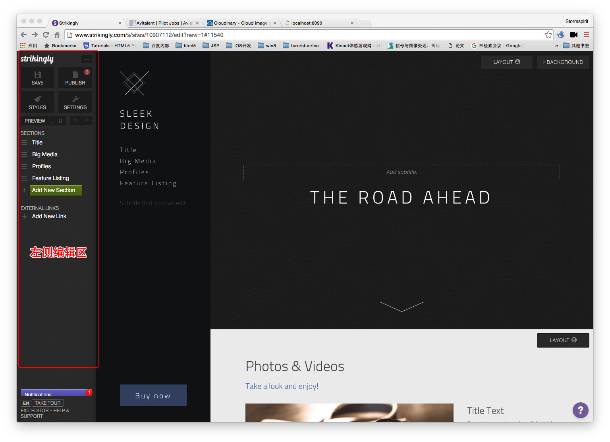

# Avitalent Editor



+ 左侧编辑区, 功能:
    + 只提供一种`View`模板 
    + 修改`View.props.name`
    + 增加`View`到右侧预览区
    + 删除`View`
    
+ `View`组件, 功能:
    + 自带一个`Title`组件
    + ~~自适应填充右侧区域宽高~~
    + 内容超过使用滚动条
    + ~~滚动时切换左侧`AviLefNav.List`~~
    + ~~左侧切换滚动到对应位置~~
    + 添加子组件
    + 删除子组件
    
+ 子组件:
    + ~~`Title`组件~~
    + `AlloyEditor`修改文字内容详细样式
    
### 整体维护一个`JSON`样式

```JavaScript
// 只管结构
{
    "name": "Title"
    "id": "1"
    "children":
}

// for Component对外提供的props描述
{
    "Title": {
        level: 
    }
}

// for 用户 
{
    "1": {
        level: 1,
        isUpperCase: true
    }
}
```